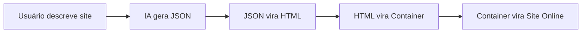

# 🔍 Page Magic - Análise de Implementações Pendentes

## 📊 Resumo Executivo

**Status Atual:** 70% da arquitetura base implementada
**Lacunas Críticas:** 30% de funcionalidades essenciais pendentes

Embora a arquitetura principal e estrutura de microserviços estejam completas, várias funcionalidades críticas descritas no documento de engenharia ainda precisam ser implementadas para atingir o MVP completo.

---

## 🚨 LACUNAS CRÍTICAS IDENTIFICADAS

### 1. **AUTH-SVC - Funcionalidades Avançadas Pendentes**

**Status:** Estrutura ✅ | Funcionalidades Avançadas ❌

**Pendências Críticas:**
- ❌ **OAuth providers** (Google, GitHub, etc.) - mencionado no documento
- ❌ **2FA/MFA** - autenticação de dois fatores
- ❌ **Sessões avançadas** - gerenciamento de sessões múltiplas
- ❌ **Rate limiting** por usuário/IP
- ❌ **Audit logs** - logs de acesso e mudanças
- ❌ **Password recovery** tradicional (além do magic link)
- ❌ **User roles e permissions** - sistema de permissões
- ❌ **Device tracking** - rastreamento de dispositivos

**Endpoints Críticos Ausentes:**
```http
POST /v1/auth/oauth/{provider}     # OAuth flow
POST /v1/auth/2fa/enable          # Habilitar 2FA
POST /v1/auth/sessions            # Gerenciar sessões
GET  /v1/auth/audit-logs          # Logs de auditoria
```

### 2. **PROMPT-SVC - Integração IA e Features Avançadas**

**Status:** Estrutura ✅ | Integração IA Real ❌

**Pendências Críticas:**
- ❌ **Integração real com vLLM cluster** - apenas estrutura
- ❌ **LangChain implementation** - orquestração de prompts
- ❌ **Streaming multipart responses** - essencial para UX
- ❌ **JSON Schema validation** da saída IA
- ❌ **Template system robusto** - templates de geração
- ❌ **Context management** - contexto de conversação
- ❌ **Fallback providers** - backup quando vLLM falha
- ❌ **Token counting e billing** - medição de tokens

**Endpoints Críticos Ausentes:**
```http
GET  /v1/generate/stream          # Streaming response
POST /v1/continue                 # Continuar geração
POST /v1/rewrite                  # Reescrever seção
GET  /v1/templates/{category}     # Templates por categoria
```

### 3. **BUILDER-SVC - Sistema AST e Geração Real**

**Status:** Estrutura ✅ | Lógica de Build ❌

**Pendências Críticas:**
- ❌ **JSON → AST conversion** - conversão real
- ❌ **AST → HTML/React generation** - geração de código
- ❌ **Component library integration** - biblioteca de componentes
- ❌ **CSS optimization** - otimização e minificação
- ❌ **Responsive code generation** - mobile/tablet/desktop
- ❌ **Theme system implementation** - sistema de temas
- ❌ **Animation system** - animações e transições
- ❌ **A11y compliance** - acessibilidade automática

**APIs Críticas Ausentes:**
```http
POST /v1/ast                      # Converter para AST
GET  /v1/ast/{id}/preview         # Preview do AST
POST /v1/ast/{id}/optimize        # Otimizar código
```

### 4. **BUILD-SVC - Pipeline de Build Real**

**Status:** Estrutura ✅ | Build Pipeline ❌

**Pendências Críticas:**
- ❌ **Docker Buildx integration** - build de imagens
- ❌ **Turbopack integration** - bundling rápido
- ❌ **Multi-framework support** - React, Vue, Angular
- ❌ **Image optimization** - compressão automática
- ❌ **PWA generation** - service workers, manifest
- ❌ **Sitemap generation** - SEO automático
- ❌ **Lighthouse scoring** - métricas de performance
- ❌ **Deploy artifact generation** - assets finais

### 5. **HOST-SVC - Orquestração de Containers**

**Status:** Estrutura ✅ | Docker Swarm Integration ❌

**Pendências Críticas:**
- ❌ **Docker Swarm API integration** - criação de stacks
- ❌ **Container lifecycle management** - start/stop/scale
- ❌ **Health checking** - monitoramento de containers
- ❌ **Resource management** - CPU/memória/storage
- ❌ **Load balancing** - distribuição de tráfego
- ❌ **Auto-scaling** - escala automática
- ❌ **Rollback capabilities** - volta de versões
- ❌ **Log aggregation** - coleta de logs

### 6. **USAGE-PROXY - Medição Real**

**Status:** Estrutura ✅ | Nginx+Lua Implementation ❌

**Pendências Críticas:**
- ❌ **Nginx configuration real** - configuração completa
- ❌ **Lua scripts implementation** - auth_check, usage_tracker
- ❌ **Rate limiting logic** - limite por usuário/plano
- ❌ **Metrics collection** - coleta de métricas detalhadas
- ❌ **Header injection** - x-meter-event headers
- ❌ **Edge caching** - cache inteligente
- ❌ **Request routing** - roteamento por domínio
- ❌ **SSL termination** - terminação TLS

### 7. **METER-SVC - Stripe Meters 2025**

**Status:** Estrutura ✅ | Stripe Integration ❌

**Pendências Críticas:**
- ❌ **Stripe Meters API** - integração real com Stripe 2025
- ❌ **Event aggregation** - agregação de eventos de uso
- ❌ **Batch sending** - envio em lotes para Stripe
- ❌ **Retry logic** - reenvio em caso de falha
- ❌ **Usage quotas** - limites por plano
- ❌ **Real-time metrics** - métricas em tempo real
- ❌ **Historical data** - dados históricos
- ❌ **TimescaleDB queries** - queries otimizadas

**Meters Obrigatórios Ausentes:**
```
page_generate   - Contagem de gerações
ai_token       - Soma de tokens consumidos
container_hours - Horas de container ativo
storage_gb     - Armazenamento total usado
```

### 8. **I18N-SVC - Internacionalização Completa**

**Status:** Estrutura ✅ | Sistema i18n ❌

**Pendências Críticas:**
- ❌ **Translation bundles** - arquivos de tradução
- ❌ **Locale detection** - detecção de idioma
- ❌ **Dynamic loading** - carregamento dinâmico
- ❌ **Key management** - gerenciamento de chaves
- ❌ **Fallback system** - idioma padrão
- ❌ **Context support** - contextos de tradução
- ❌ **Pluralization** - regras de pluralização
- ❌ **Date/number formatting** - formatação por locale

---

## 📱 FRONT-END E MOBILE - LACUNAS CRÍTICAS

### 9. **FRONT-WEB - Dashboard e Editor Visual**

**Status:** Estrutura Básica ✅ | Features Principais ❌

**Pendências Críticas:**
- ❌ **Visual Editor** - editor WYSIWYG completo
- ❌ **Dashboard completo** - analytics, sites, billing
- ❌ **Component Library** - biblioteca de componentes
- ❌ **Theme Picker** - seletor de temas
- ❌ **Asset Manager** - gerenciador de mídia
- ❌ **Preview System** - sistema de preview real-time
- ❌ **Form Builder** - construtor de formulários
- ❌ **SEO Tools** - ferramentas de SEO

**Páginas Críticas Ausentes:**
```
/dashboard          # Dashboard principal
/sites/{id}/edit    # Editor visual
/billing            # Página de cobrança
/domain-manager     # Gerenciador de domínios
/analytics          # Analytics detalhado
```

### 10. **MOBILE-APP - App Nativo Completo**

**Status:** Estrutura Básica ✅ | Features Nativas ❌

**Pendências Críticas:**
- ❌ **Navegação completa** - React Navigation
- ❌ **Autenticação integrada** - login/signup
- ❌ **WebView Editor** - editor mobile
- ❌ **Push Notifications** - notificações nativas
- ❌ **Deep Linking** - pagemagic:// scheme
- ❌ **Offline Support** - sincronização offline
- ❌ **In-App Payments** - Stripe mobile
- ❌ **Camera Integration** - upload de imagens
- ❌ **Share System** - compartilhamento nativo

**Telas Críticas Ausentes:**
```
AuthScreen          # Login/signup
DashboardScreen     # Dashboard mobile
EditorScreen        # Editor mobile
PreviewScreen       # Preview com WebView
SettingsScreen      # Configurações
BillingScreen       # Cobrança mobile
```

---

## 🔧 INFRAESTRUTURA E OBSERVABILIDADE

### 11. **Observabilidade Completa**

**Pendências Críticas:**
- ❌ **Prometheus metrics** em todos os serviços
- ❌ **Grafana dashboards** - dashboards específicos
- ❌ **Distributed tracing** - Jaeger/OpenTelemetry
- ❌ **Log aggregation** - Loki/ELK stack
- ❌ **Alerting rules** - Alertmanager
- ❌ **Health checks** avançados
- ❌ **Performance monitoring** - APM
- ❌ **Error tracking** - Sentry integration

### 12. **Security & Compliance**

**Pendências Críticas:**
- ❌ **CSP headers** - Content Security Policy
- ❌ **WAF rules** - Web Application Firewall
- ❌ **PCI compliance** - validação PCI-DSS
- ❌ **GDPR/LGPD** - compliance total
- ❌ **Security scanning** - OWASP ZAP
- ❌ **Vulnerability scanning** - dependências
- ❌ **TLS 1.3 enforcement** - apenas TLS 1.3
- ❌ **Container security** - non-root users

### 13. **CI/CD Pipeline**

**Pendências Críticas:**
- ❌ **GitHub Actions** - workflows completos
- ❌ **Automated testing** - unit, integration, E2E
- ❌ **Quality gates** - SonarQube, code coverage
- ❌ **Security scanning** - container security
- ❌ **Deployment automation** - GitOps com Flux
- ❌ **Rollback automation** - rollback automático
- ❌ **Staging environment** - ambiente de testes
- ❌ **Production deployment** - deploy produção

---

## 📋 TESTES - COBERTURA ZERO

**Status:** ❌ **NENHUM TESTE IMPLEMENTADO**

**Tipos de Teste Necessários:**
- ❌ **Unit Tests** - todos os serviços (0% coverage)
- ❌ **Integration Tests** - APIs entre serviços
- ❌ **E2E Tests** - fluxos completos (Cypress/Playwright)
- ❌ **Load Tests** - performance (k6/Artillery)
- ❌ **Security Tests** - penetration testing
- ❌ **Mobile Tests** - Detox para React Native
- ❌ **API Tests** - Postman/Newman collections
- ❌ **Contract Tests** - Pact testing

---

## 🎯 PRIORIDADES PARA MVP

### **Fase 1: Core Functionality (Semanas 1-3)**
1. **Integração IA real** - vLLM/OpenAI working
2. **Build pipeline** - Docker Buildx + deploy
3. **Auth completo** - OAuth + JWT + sessions
4. **Frontend básico** - dashboard + editor simples

### **Fase 2: Hosting & Billing (Semanas 4-6)**
1. **Container orchestration** - Docker Swarm
2. **Domain management** - DNS + SSL automático
3. **Usage tracking** - Nginx + Stripe Meters
4. **Mobile app MVP** - login + preview

### **Fase 3: Production Ready (Semanas 7-9)**
1. **Observabilidade** - Prometheus + Grafana
2. **Testing suite** - unit + integration + E2E
3. **Security hardening** - CSP + WAF + compliance
4. **CI/CD pipeline** - GitHub Actions + GitOps

---

## 📊 Métrica de Completude

| Categoria | Implementado | Pendente | % Completo |
|-----------|-------------|----------|------------|
| **Arquitetura** | ✅ 100% | - | 100% |
| **Microserviços Base** | ✅ 70% | 30% | 70% |
| **Frontend/Mobile** | ✅ 30% | 70% | 30% |
| **Integração IA** | ❌ 10% | 90% | 10% |
| **Build/Deploy** | ❌ 20% | 80% | 20% |
| **Observabilidade** | ❌ 0% | 100% | 0% |
| **Testes** | ❌ 0% | 100% | 0% |
| **Security** | ❌ 10% | 90% | 10% |

**Total Geral:** **40% implementado, 60% pendente**

---

## 🎯 NOVA ESTRATÉGIA: FOCO NO FLUXO END-TO-END

### **� MUDANÇA DE ABORDAGEM**

**ANTES:** Implementar features individuais isoladamente
**AGORA:** Implementar fluxo completo funcionando de ponta a ponta

### **📋 FLUXO CRÍTICO IDENTIFICADO**



**Status Atual:** 0/4 etapas do fluxo crítico funcionando

### **🚀 Próximos Passos FOCADOS**

**Semana 1-2: FLUXO MÍNIMO FUNCIONANDO**
1. **OpenAI integration** (prompt-svc) - gerar JSON estruturado
2. **HTML templates** (builder-svc) - JSON → HTML responsivo  
3. **Container build** (build-svc) - HTML → Docker container
4. **Deploy simples** (host-svc) - container → site online
5. **Interface básica** (front-web) - textarea → preview → deploy

**Semana 3: ESTABILIDADE**
6. **Error handling** robusto entre serviços
7. **Performance optimization** (<30s end-to-end)
8. **Basic monitoring** (health checks + logs)

**Semana 4+: FEATURES AVANÇADAS**
9. Só DEPOIS do fluxo funcionando: OAuth, Stripe, editor visual, etc.

### **🎯 META CLARA**

**Definição de Sucesso:** Usuário vai em pagemagic.dev, digita "site para loja de café", 30 segundos depois tem site online acessível.

**KPI:** Fluxo end-to-end < 30 segundos, > 90% success rate

---

## 📋 IMPLEMENTAÇÃO DETALHADA

Ver documento completo: `END_TO_END_IMPLEMENTATION_PLAN.md`

O projeto tem uma **excelente base arquitetural**, mas precisa de **foco laser no fluxo principal** antes de features avançadas. Uma vez que o usuário consegue ir de ideia até site online, podemos iterar e melhorar cada componente individual.
